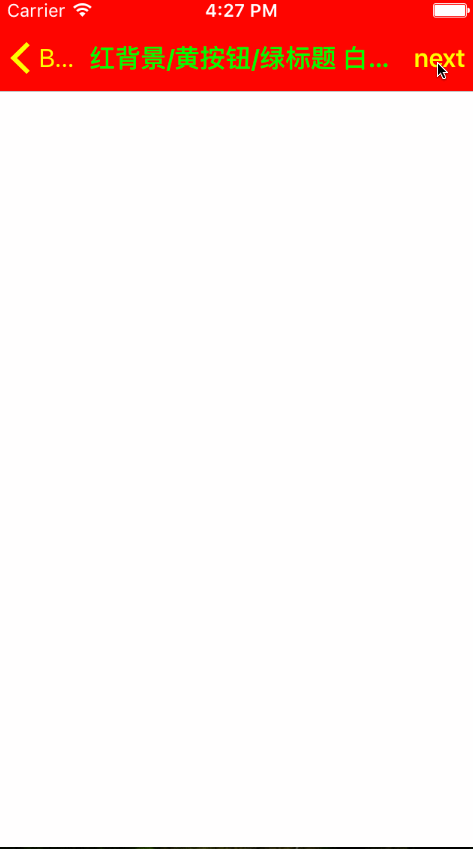
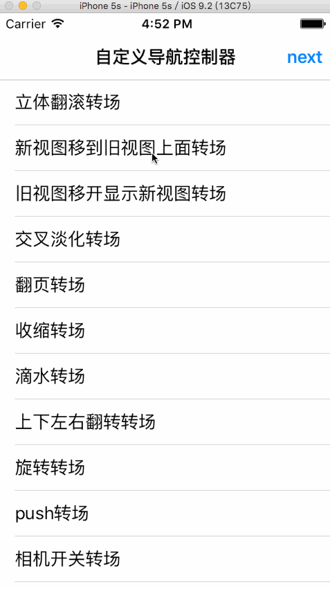

# SYNavigationViewController
可以自定义不同样式的导航栏样式的导航栏视图控制器（有push动画效果）

# 效果图
#### 导航栏样式

#### 转场动画

# 功能介绍说明
使用继承UINavigationContoller的封装类SYNavigationController，便于设置自定义的导航栏样式，效果优于使用未封装UINavigationContoller时的效果。
 * 有push动画的层级效果（未封装UINavigationContoller的无）
 * 样式设置方法可以在viewDidLoad方法中实现（未封装UINavigationContoller的通常在viewWillAppear，或viewWillDisappear方法中实现）
 * 样式设置后不同的视图控制器互不影响（未封装UINavigationContoller的会相互影响）
 * 同时可以设置状态栏字体样式，黑色或白色

# 使用方法
~~~ javascript
// 导入头文件
#import "SYNavigationController.h"
~~~ 

~~~ javascript
// 定义根视图
ViewController *rootVC = [[ViewController alloc] init];
SYNavigationController *rootNav = [[SYNavigationController alloc] initWithRootViewController:rootVC];
rootNav.showBackBarButtonItem = YES;
rootNav.transferNavigationBarAttributes = NO;
rootVC.showCancelBarButtonItem = YES;
~~~ 

~~~ javascript
// 修改导航栏样式
[self navigationStyleWithBackgroundColor:[UIColor brownColor] buttonColor:[UIColor yellowColor] titleColor:[UIColor greenColor] titleFont:[UIFont systemFontOfSize:12.0]];
~~~ 

~~~ javascript
// 修改状态栏样式
- (UIStatusBarStyle)preferredStatusBarStyle
{
    // 黑色字体UIStatusBarStyleDefault、白色字体UIStatusBarStyleLightContent
    return UIStatusBarStyleDefault;
}
~~~ 

# 注意事项
 * 1 获取视图控制器数组
~~~ javascript
// 错误方法
NSLog(@"%@ 是 %@ 中的第 %@ 个视图控制器", self, @(self.navigationController.viewControllers.count), @([self.navigationController.viewControllers indexOfObject:self]));

// 正确方法
NSLog(@"%@ 是 %@ 中的第 %@ 个视图控制器", self, @(self.sy_navigationController.sy_viewControllers.count), @([self.sy_navigationController.sy_viewControllers indexOfObject:self]));
~~~ 

 * 2

#### 修改
* 20170605
  * 添加转场动画设置
~~~ javascript
// 方法
/**
*  转场动画
*
*  @param duration 动画时间（默认0.3秒）
*  @param type     动画类型-动画形式（默认）
*  @"cube"                  立方体翻滚效果
*  @"moveIn"                新视图移到旧视图上面
*  @"reveal"                显露效果(将旧视图移开,显示下面的新视图)
*  @"fade"                  交叉淡化过渡(不支持过渡方向)(默认为此效果)
*  @"pageCurl"              向上翻一页
*  @"pageUnCurl"            向下翻一页
*  @"suckEffect"            收缩效果，类似系统最小化窗口时的神奇效果(不支持过渡方向)
*  @"rippleEffect"          滴水效果,(不支持过渡方向)
*  @"oglFlip"               上下左右翻转效果
*  @"rotate"                旋转效果
*  @"push"
*  @"cameraIrisHollowOpen"  相机镜头打开效果(不支持过渡方向)
*  @"cameraIrisHollowClose" 相机镜头关上效果(不支持过渡方向)
*  kCATransitionFade        交叉淡化过渡
*  kCATransitionMoveIn      新视图移到旧视图上面
*  kCATransitionPush        新视图把旧视图推出去
*  kCATransitionReveal      将旧视图移开,显示下面的新视图
*
*  @param subType  动画子类型-动画方向
*  kCATransitionFromRight; 同字面意思(下同)
*  kCATransitionFromLeft;
*  kCATransitionFromTop;
*  kCATransitionFromBottom;
*
*  当type为@"rotate"(旋转)的时候,它也有几个对应的subtype,分别为:
*  90cw   逆时针旋转90°
*  90ccw  顺时针旋转90°
*  180cw  逆时针旋转180°
*  180ccw 顺时针旋转180°
*
*  @param function 动画轨迹模式
*  kCAMediaTimingFunctionLinear        线性,即匀速
*  kCAMediaTimingFunctionEaseIn        先慢后快
*  kCAMediaTimingFunctionEaseOut       先快后慢
*  kCAMediaTimingFunctionEaseInEaseOut 先慢后快再慢
*  kCAMediaTimingFunctionDefault       实际效果是动画中间比较快
*
*/
- (void)navigationControllerAnimation:(NSTimeInterval)duration type:(NSString *)type subType:(NSString *)subType function:(NSString *)function;

// 示例
[self.sy_navigationController navigationControllerAnimation:0.6 type:@"oglFlip" subType:kCATransitionFromLeft function:kCAMediaTimingFunctionLinear];
~~~

